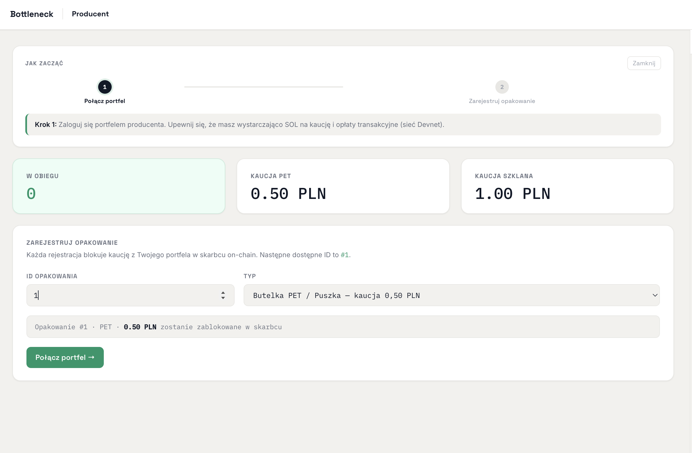

# Bottleneck

> Submitted for the **Superteam Bounty** — Solana hackathon track.

---

## The Problem — Poland's Kaucja Is Broken

If you've ever bought a bottle of water or a beer in Poland, you've paid **kaucja** — a small deposit (usually 50 groszy or 1 złoty) added to the price of the bottle. The idea is simple: return the bottle, get your money back. Encourage recycling.

**In practice, it almost never works.**

Here's what actually happens:

1. You buy a drink. You pay the deposit.
2. You bring the bottle back to the shop.
3. The cashier accepts it — but instead of giving you cash, they hand you a **paper voucher**.
4. That voucher is only valid **in that exact store**, and only if you spend it **right then and there**.
5. You leave without buying anything? The money is gone.
6. You go to a different shop? Useless piece of paper.

So you returned your bottle. You did the right thing. But you didn't get your money back.

Now multiply this by **4 billion bottles a year** in Poland alone. That's a lot of people not getting their deposits back. And a lot of money sitting in a system that nobody can properly audit.

The stores are also frustrated — they accept bottles and wait **weeks** to be reimbursed by the central operator. Producers argue over how many containers they actually put into circulation. The whole system runs on spreadsheets and trust.

Nobody is necessarily stealing. But nobody can *prove* nobody is stealing either.

---

## How It Works on Solana

Bottleneck moves the deposit lifecycle onto a public blockchain. Every bottle gets a unique on-chain record. Every deposit is locked in a smart contract the moment the producer registers the bottle. Every return credits both the consumer and the store instantly.

```
Producer registers a bottle
  → deposit locked in the smart contract vault

Consumer buys the drink, links their wallet on-chain (purchase_container)
  → their wallet is now tied to that exact bottle

Consumer returns it to a store
  → store submits return_container on-chain in one transaction:
       consumer's claimable refund += deposit
       store's reimbursement += deposit

Consumer clicks Claim → refund arrives in seconds
Store clicks Settle   → reimbursement arrives in seconds
```

No central operator holding the money. No vouchers. No waiting weeks. The contract holds the deposits and releases them automatically — and anyone can verify the math at any time.

---

## Devnet Transaction Links

Program deployed at: [`CmcEwPFFefG2BpzPe2q4eUCAVijdxLf18ppDyLWYRCti`](https://explorer.solana.com/address/CmcEwPFFefG2BpzPe2q4eUCAVijdxLf18ppDyLWYRCti?cluster=devnet)

Full happy-path demo (container #50, PET, 0.50 PLN deposit):

| Step | Instruction | Explorer |
|---|---|---|
| 1 | `register_container` — producer locks 500,000 lamports | [view tx](https://explorer.solana.com/tx/5CKCZ5FEfWX1X5MDkeFgb7NToaRwtg1Qbnftuzb8TU4okH8uD65zUTF69DoZsW6q3GBkhNLin961VHT8WCnaQkuf?cluster=devnet) |
| 2 | `purchase_container` — consumer links wallet | [view tx](https://explorer.solana.com/tx/4akQNfUNFZKgvRoFTRB8rSnoVTEr3ciMEGUQ1c54qJEkte3NiEQ9K6hdBp2dkncun5BiUTeutUD6gqX1hZTn41a5?cluster=devnet) |
| 3 | `return_container` — store submits return, both parties credited | [view tx](https://explorer.solana.com/tx/2Gg9EUYJasQNHGVS9pD5ZQc73nrWiXxuugF1N1y5rp3qLWsgxX8YtG2Zu3MBRdqKzkvvUqQYXyt1CbzHVFC6pjEi?cluster=devnet) |
| 4 | `claim_refund` — consumer receives 500,000 lamports | [view tx](https://explorer.solana.com/tx/2FuxPiaJt8Ry8izQKvjQfsU7qnk1YdjxhKdipq9LVZiWd6BQU4tv56J2H6fokqEeg2EVAKtivM2hGotAXNeYWfSf?cluster=devnet) |
| 5 | `settle_store` — store receives 500,000 lamports | [view tx](https://explorer.solana.com/tx/4oUL1gYKKpZQnLnKgoGyqWQxWH5jnamRP1rgvRA1GwauG56viEseKmiQDQws4NmvtJL1a6u3wbWkhKRyCretjYEQ?cluster=devnet) |

---

## Screenshots




---

## Architecture

**Accounts (all PDAs):**

| Account | Seeds | Purpose |
|---|---|---|
| `SystemConfig` | `["config"]` | Authority, deposit amounts, global counters |
| Vault | `["vault"]` | Raw SOL account holding all locked deposits |
| `Container` | `["container", id_u64_le]` | Per-bottle record: type, status, owner, deposit |
| `ConsumerBalance` | `["consumer", wallet]` | Accumulated claimable lamports per consumer |
| `CollectionPoint` | `["store", wallet]` | Accumulated reimbursable lamports per store |

**Seven instructions:**

| Instruction | Who | What |
|---|---|---|
| `initialize_system` | Authority (once) | Creates Config + Vault, sets deposit amounts |
| `register_container` | Producer | Locks deposit → Vault, creates Container |
| `purchase_container` | Consumer | Links consumer wallet to Container |
| `return_container` | Store | Status = Returned, credits ConsumerBalance + CollectionPoint |
| `claim_refund` | Consumer | Transfers claimable lamports from Vault to consumer |
| `settle_store` | Store | Transfers reimbursable lamports from Vault to store |
| `sweep_unclaimed` | Authority | Recovers deposits from containers past the unclaim threshold |

**Vault OUT pattern** (direct lamport mutation, no System CPI out of PDA):
```rust
**vault.try_borrow_mut_lamports()? -= amount;
**recipient.try_borrow_mut_lamports()? += amount;
```

All balance math uses `checked_add` / `checked_sub` → `MathOverflow`. Every instruction emits an `emit!()` event consumed by the frontend live feed.

---

## Tradeoffs & Constraints

**Tradeoffs:**

- **Lamports instead of a token** — using native SOL keeps the system dependency-free and avoids token account rent overhead. Tradeoff: deposit amounts are fixed in lamports at deployment; a stablecoin token would allow PLN-pegged amounts.
- **ConsumerBalance as a separate account** — rather than encoding balance into each Container, balances accumulate per-consumer so a consumer can return many bottles and claim once. Tradeoff: one extra account created per unique consumer (rent ~0.001 SOL).
- **CollectionPoint per store** — stores accumulate pending reimbursements in one PDA rather than settling per-container, batching transaction costs. Tradeoff: the store must call `settle_store` explicitly rather than receiving funds automatically per return.
- **Anchor over native** — chosen for account constraint safety (discriminator checks, PDA validation, `has_one`). Tradeoff: larger binary, slightly more compute per instruction.

**Constraints:**

- Deposit amounts are global, set at `initialize_system` — no per-SKU pricing without a new account type
- `sweep_unclaimed` is authority-gated and time-locked by slot threshold — the authority keypair is the single centralized trust point
- No SPL token support — refunds land as SOL, not USDC or a PLN stablecoin

---

## Running Locally

**Run tests:**
```bash
anchor test
```

**Frontend (connect Phantom/Solflare to Devnet):**
```bash
cd frontend && npm install && npm run dev
# → http://localhost:5173
```

**CLI demo:**
```bash
cd cli && npm install
bash demo.sh
```

**Roles in the frontend:**
- **Klient (Consumer)** — purchase a container, claim your refund
- **Sklep (Store)** — accept returns, settle reimbursement
- **Producent (Producer)** — register containers, lock deposits
- **Panel (Dashboard)** — live system state, flow meter, operator tools

---

*Bottleneck is a proof of concept. The same model applies to any country with a container deposit law.*
