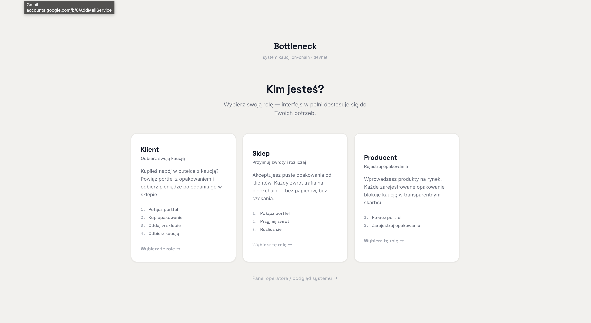
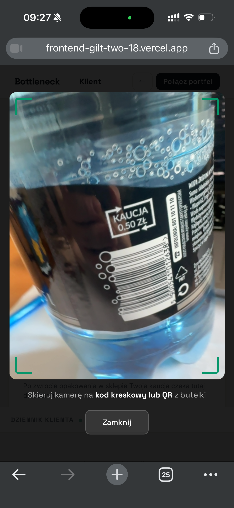

# Bottleneck

> **On-chain bottle deposit return system built on Solana.**  
> Submitted for the Superteam Bounty.

**[→ Try it live on Devnet](https://frontend-gilt-two-18.vercel.app)** · connect Phantom or Solflare

---

## The problem nobody is fixing

Poland has a mandatory bottle deposit law — **kaucja**. Every PET bottle you buy costs 0.50 PLN extra. Every glass bottle costs 1.00 PLN. The idea: return the bottle, get your money back. Encourage recycling.

**Here's what actually happens:**

You bring the bottle back to the shop. The cashier takes it. Then hands you a **paper voucher** — only valid in that exact store, only if you spend it right now on something else. Leave without buying? Money gone. Go to a different store? Useless paper.

So you did the right thing. You got nothing.

**4 billion bottles a year in Poland alone.** Producers don't know how many containers are actually in circulation. Stores wait weeks to get reimbursed by the central operator. The whole thing runs on spreadsheets, fax machines, and trust — with zero on-chain accountability.

Nobody is necessarily stealing. But nobody can *prove* nobody is stealing either.

---

## The fix

Bottleneck puts the entire deposit lifecycle on a public blockchain. Each bottle gets a unique on-chain record. The deposit is locked in a smart contract the moment the producer registers it. When the bottle comes back, both the consumer and the store are credited — instantly, in one transaction.



**Three roles. One shared ledger.**

- **Producer** registers a bottle → deposit locked on-chain immediately, no intermediary
- **Consumer** scans the barcode → links their wallet to that exact bottle
- **Store** accepts the return → consumer's refund and store's reimbursement credited in the same tx




No vouchers. No waiting. No central operator holding the money. The contract releases deposits automatically — and every transaction is publicly verifiable.

---

## Live on Devnet

**Program:** [`CmcEwPFFefG2BpzPe2q4eUCAVijdxLf18ppDyLWYRCti`](https://explorer.solana.com/address/CmcEwPFFefG2BpzPe2q4eUCAVijdxLf18ppDyLWYRCti?cluster=devnet)

Full end-to-end flow verified on-chain:

| Step | Instruction | |
|---|---|---|
| Producer locks deposit | `register_container` | [tx ↗](https://explorer.solana.com/tx/5CKCZ5FEfWX1X5MDkeFgb7NToaRwtg1Qbnftuzb8TU4okH8uD65zUTF69DoZsW6q3GBkhNLin961VHT8WCnaQkuf?cluster=devnet) |
| Consumer links wallet | `purchase_container` | [tx ↗](https://explorer.solana.com/tx/4akQNfUNFZKgvRoFTRB8rSnoVTEr3ciMEGUQ1c54qJEkte3NiEQ9K6hdBp2dkncun5BiUTeutUD6gqX1hZTn41a5?cluster=devnet) |
| Store accepts return | `return_container` | [tx ↗](https://explorer.solana.com/tx/2Gg9EUYJasQNHGVS9pD5ZQc73nrWiXxuugF1N1y5rp3qLWsgxX8YtG2Zu3MBRdqKzkvvUqQYXyt1CbzHVFC6pjEi?cluster=devnet) |
| Consumer claims refund | `claim_refund` | [tx ↗](https://explorer.solana.com/tx/2FuxPiaJt8Ry8izQKvjQfsU7qnk1YdjxhKdipq9LVZiWd6BQU4tv56J2H6fokqEeg2EVAKtivM2hGotAXNeYWfSf?cluster=devnet) |
| Store settles | `settle_store` | [tx ↗](https://explorer.solana.com/tx/4oUL1gYKKpZQnLnKgoGyqWQxWH5jnamRP1rgvRA1GwauG56viEseKmiQDQws4NmvtJL1a6u3wbWkhKRyCretjYEQ?cluster=devnet) |

---

## Architecture

**Five PDAs, seven instructions, zero trusted intermediary.**

| Account | Seeds | Purpose |
|---|---|---|
| `SystemConfig` | `["config"]` | authority, deposit amounts, counters |
| `Vault` | `["vault"]` | all locked SOL |
| `Container` | `["container", id_u64_le]` | per-bottle state, status, owner |
| `ConsumerBalance` | `["consumer", wallet]` | accumulated claimable lamports |
| `CollectionPoint` | `["store", wallet]` | accumulated reimbursable lamports |

Vault payouts use direct lamport mutation — no System CPI out of a PDA. All math is `checked_add`/`checked_sub`. Every instruction emits an `emit!()` event picked up by the frontend live feed.

---

## Run locally

```bash
anchor test                                     # program tests
cd frontend && npm install && npm run dev       # UI → localhost:5173
cd cli && npm install && bash demo.sh           # CLI end-to-end demo
```

---

*The same model applies to any country with a container deposit law.*
